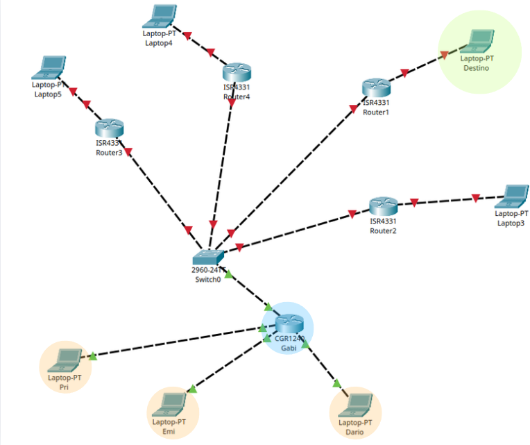

# Topologia de Red
---

  

---

# 🌐 Reporte de Encabezados de Red
### Topología de Red 

---

## 🛰️ PERSPECTIVA: ROUTER Gabi
> **Estado:** Gateway de Subred

| Capa | Campo | Valor |
| :--- | :--- | :--- |
| **Enlace (L2)** | **MAC DESTINO** | *(Pendiente)* |
| | **MAC ORIGEN** | `AD:71:88` |
| **Red (L3)** | **IP ORIGEN** | `10.9.0.1` |
| | **IP DESTINO** | *(Pendiente)* |
| | **TTL** | `6` |
| | **PAYLOAD** | `6AD4` → `0110101011010100` |
| | **CRC** | `<vacío por ahora>` |

---

## 💻 PERSPECTIVA: HOST 1 (Pri)
> **Rol:** Estación de Trabajo

| Capa | Campo | Valor |
| :--- | :--- | :--- |
| **Enlace (L2)** | **MAC DESTINO** | `AD:71:88` (Router Gabi) |
| | **MAC ORIGEN** | `AB:43:17` |
| **Red (L3)** | **IP ORIGEN** | `10.9.0.101` |
| | **IP DESTINO** | `10.12.0.105` |
| | **TTL** | `6` |
| | **PAYLOAD** | `4C9A` → `0100110010011010` |
| | **CRC** | `<vacío por ahora>` |

---

## 💻 PERSPECTIVA: HOST 2 (Emi)
> **Rol:** Estación de Trabajo

| Capa | Campo | Valor |
| :--- | :--- | :--- |
| **Enlace (L2)** | **MAC DESTINO** | `AD:71:88` (Router Gabi) |
| | **MAC ORIGEN** | `43555744` |
| **Red (L3)** | **IP ORIGEN** | `10.9.0.102` |
| | **IP DESTINO** | `10.6.0.102` |
| | **TTL** | `6` |
| | **PAYLOAD** | `9394` → `1001001110010100` |
| | **CRC** | `<vacío por ahora>` |

---

## 💻 PERSPECTIVA: HOST 3 (Dario)
> **Rol:** Estación de Trabajo

| Capa | Campo | Valor |
| :--- | :--- | :--- |
| **Enlace (L2)** | **MAC DESTINO** | `AD:71:88` (Router Gabi) |
| | **MAC ORIGEN** | `AB:41:13` |
| **Red (L3)** | **IP ORIGEN** | `10.9.0.103` |
| | **IP DESTINO** | `10.11.0.104` |
| | **TTL** | `6` |
| | **PAYLOAD** | `B5A6` → `1011010110100110` |
| | **CRC** | `<vacío por ahora>` |

---
* **TTL uniforme:** Todos los paquetes inician con `TTL: 6`.
* **Encapsulamiento:** Las direcciones MAC de destino apuntan consistentemente al Router Gabi (`AD:71:88`), indicando que el tráfico está saliendo de la red local.

---

# 🚀 Trabajo Router
>  Llegar al destino antes de que el contador llegue a cero.

| Salto | 📍 Ubicación Actual | 🛡️ MAC Origen | 🎯 MAC Destino | ⏳ TTL | ⚡ Estado del Paquete |
| :---: | :--- | :--- | :--- | :---: | :--- |
| **0** | **Host 1 (Pri)** | `AB:43:17` | `AD:71:88` | **6** | **¡Salida!** Encapsulado inicial. |
| **1** | **Router Gabi (Entrada)** | `AB:43:17` | `AD:71:88` | **6** | Procesando en Capa 3... |
| **1** | **Router Gabi (Salida)** | `AD:71:88` | `MAC_R2` | **5** | **-1 Vida.** Re-encapsulando trama. |
| **2** | **Siguiente Router** | `MAC_R2` | `MAC_R3` | **4** | Saltando por la red... |
| **3** | **Router Intermedio** | `MAC_R3` | `MAC_R4` | **3** | A mitad de camino. |
| **4** | **Router de Borde** | `MAC_R4` | `MAC_R5` | **2** | Ya casi llega a la subred destino. |
| **5** | **Último Router** | `MAC_R5` | `MAC_FINAL` | **1** | **¡Último esfuerzo!** |
| **6** | **Host Destino** | `MAC_R5` | `MAC_FINAL` | **1** | **¡LLEGÓ!** Entregado con éxito. |

---
