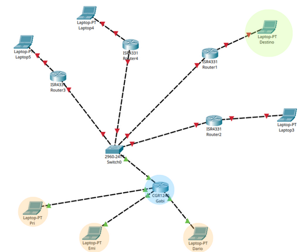

# **Trabajo Práctico N°1**

**Integrantes**:  
- _Dario Castillo_
- _Emiliano Castro_
- _Gabriel Arrieta_
- _Priscila Martinez_
 
**CTD**  

**Facultad de Ciencias Exactas, Físicas y Naturales**  

**Materia**: _Redes de Computadoras_  
**Profesores**: _Santiago M. Henn_, _Facundo O. Cuneo_  
**Fecha**: XX/03/2026  

---

## Resumen

Este trabajo práctico se divide en dos partes. En la primera se simuló el envío y recepción de paquetes IP encapsulados en frames Ethernet a través de una red con múltiples subredes, donde cada integrante asumió un rol concreto, host o default gateway. Además, el recorrido de los paquetes involucró tres routers intermedios, lo cual permitió observar el comportamiento del ruteo en una topología real. En la segunda parte se analizó la integridad de los datos transmitidos, trabajando con mecanismos de detección de errores sobre un canal de comunicación no confiable donde un intermediario podía alterar los mensajes transmitidos. Esto permitió analizar las capacidades y limitaciones de distintos algoritmos de detección de errores.

---

## Introducción

Cuando dos dispositivos se comunican a través de una red, los datos no viajan de forma directa ni garantizada. En su recorrido pasan por múltiples dispositivos intermedios, cada uno tomando decisiones locales sobre a dónde reenviar la información, modificando las cabeceras del paquete en cada salto sin alterar su contenido. Al mismo tiempo, el canal puede introducir alteraciones que comprometan la integridad de los datos transmitidos, haciendo necesario contar con mecanismos que permitan detectarlas

Este trabajo práctico aborda ambos aspectos. Inicialmente se estudia el mecanismo de ruteo y encapsulación, analizando cómo las direcciones MAC e IP cumplen roles distintos durante el recorrido de un paquete. Luego se trabaja con algoritmos de detección de errores, evaluando su comportamiento frente a mensajes potencialmente alterados. 


---

## Desarrollo | Primera parte

###  **Identificación de dispositivos y armado de la subred.**

Cada integrante del equipo fue asignado con un dispositivo de red. Con todos estos dispositivos, fue configurada la LAN interna. Las asignaciones fueron las siguientes.


| **Integrante** | MAC | IP | Tipo | Payload |
| :---: | :---: | :---: | :---: | :---: |
| Darío Castillo | AB:41:13 | 10.9.0.103 | Host | 1011010110100110 |
| Priscila Martínez | AB:43:17 | 10.9.0.102 | Host | 0100110010011010 |
| Castro Emiliano | AC:43:74 |10.9.0.101 | Host | 1001001110010100 |
| Arrieta Gabriel | AD:71:88 |10.9.0.1 | Default Gateway | - |


### **Armado de la Topología.**

Se configuró una red entre todas las subredes de cada equipo. La topología se estableció como se muestra a continuación.
<div align="center">
    
</div>
Las conexiones entre routers se simularon con hilos de lana por donde viajan los paquetes.
El switch central es una configuración de tres routers, cuyas asignaciones fueron a tres equipos encargados de determinar las trazas de los paquetes de forma óptima.

### **Conformación de los paquetes.**

Cada integrante host completó los campos de los paquetes, simulando los encapsulamientos de Capa 2 y 3, con los respectivos IP de destino y origen, MAC de destino y TTL (Time to live). El campo CRC no fue utilizado para esta parte de la práctica.
El destino fue asignado también. De esta forma, cada integrante sabía a quién enviar el paquete antes de crearlo.
Ejemplo (Paquete de Emiliano):

| **FRAME ETHERNET** | CAPA 2 |
| :--- | :--- |
| MAC DESTINO | AD:71:88 |
| MAC ORIGEN | AC:43:74 |
| **PAQUETE IP** | CAPA 3 |
| IP ORIGEN | 10.9.0.101 |
| IP DESTINO | 10.6.0.102 |
| TTL | 6 |
| PAYLOAD | 10010010110010 |
| CRC | - |
Estos paquetes se simularon con tarjetas físicas.

### **Simulación de las transmisiones y recepciones.**

- **Hosts de Origen:**
Una vez completado el paquete con los datos, se consulta la máscara de subred para determinar si el paquete pertenece a la red interna. En este caso, ningún host tuvo asignado un destino interno. Simulando el proceso ARP, se mandaron los paquetes al default gateway, de forma que el primer **MAC DESTINO** es el de este dispositivo. Toda la encapsulación del frame ethernet y del paquete IP quedó como se muestra en la tabla.
Ejemplo (Frame de Priscila):

| **FRAME ETHERNET** | |
| :--- | :--- |
| MAC DESTINO | AD:71:88 (Default Gateway) |
| MAC ORIGEN | AB:43:17 |
| **PAQUETE IP** | |
| IP ORIGEN | 10.9.0.102 |
| IP DESTINO | 10.12.0.105 |
| TTL | 6 |
| PAYLOAD | 0100110010011010 |
| CRC | - |


- **Router:**
El router recibió los frames ethernet de cada host. Los desencapsuló, de forma que obtuvo los paquetes IP. Decrementó el TTL de cada uno, y consultó al equipo del router más cercano, su MAC. Este último procedimiento simuló una ARP request de un router intermediario, debido a que inicialmente no hay tabla de enrutamiento. Una vez obtenida la dirección MAC del siguiente salto, se encapsuló nuevamente en una trama ethernet de Capa 2, con el MAC ORIGEN del propio router (default gateway) y el MAC DESTINO del next-hop.
Siguiendo el mismo ejemplo, el paquete de Priscila cambió de la siguiente manera:
 
| **FRAME ETHERNET** | |
| :--- | :--- |
| MAC DESTINO | ~~AD:71:88~~ AC:43:17 |
| MAC ORIGEN | ~~AB:43:17~~ AD:71:88|
| **PAQUETE IP** | |
| IP ORIGEN | 10.9.0.102 |
| IP DESTINO | 10.12.0.105 |
| TTL | ~~6~~ 5 |
| PAYLOAD | 0100110010011010 |
| CRC | - |

- **Host Destino:**
Una vez transcurrido el procesamiento de los paquetes por parte de los routers en el switch central, llegaron a la red interna las tres tramas ethernet correspondientes. El procesamiento de desencapsulamiento fue: Leer la dirección MAC de DESTINO y verificar que era la de nuestros dispositivos, leer la dirección IP para verificar, y finalmente leer el payload.
De esta forma se concretó la comunicación.
El paquete que llegó a Priscila fue el siguiente:

| **FRAME ETHERNET** | |
| :--- | :--- |
| MAC DESTINO | ~~AB:40:39~~ ~~AC:45:70~~ ~~AA:45:92~~ ~~AD:71:88~~ AB:43:17|
| MAC ORIGEN | ~~AC:44:07~~ ~~AB:40:39~~ ~~AC:45:70~~ ~~AA:45:92~~ AD:71:88 |
| **PAQUETE IP** | |
| IP ORIGEN | 10.9.0.102 |
| IP DESTINO | 10.12.0.105 |
| TTL | ~~6~~ ~~5~~ ~~4~~ 3 |
| PAYLOAD | 0100110010011010 |
| CRC | - |

Se puede observar con claridad los pasos de la traza del paquete, viajando por la red. 

### **Reflexiones y documentación**

**Direccionamiento logico (IP) y físico (MAC)**

La dirección IP funciona como un identificador lógico de extremo a extremo, su objetivo es señalar la ubicación final del host en la red global. Y debido a que el destino del paquete no varía durante la transmisión, esta dirección permanece constante, lo cual asegura que la información llegue correctamente a través de múltiples redes interconectadas, independientemente del camino que tome. 

Por otro lado, la dirección MAC es un identificador físico con alcance de enlace local, válido solo dentro de un mismo segmento de red. Por ende, cada vez que el paquete llega a un router, este lo desencapsula, analiza la IP de destino y genera un nuevo frame ethernet con la dirección MAC del siguiente salto o del destino final, de modo que este valor cambia en cada tramo físico del recorrido.

**Gateway vs host**

El protocolo ARP que utilizamos para descubrir direcciones MAC funciona mediante mensajes de broadcasts locales que no pueden atravesar routers, es decir, solo sirve para descubrir dispositivos dentro de la misma subred. Por ende, si el destino está en otra red y el host intenta alcanzarlo, su petición nunca saldría de la red local y la comunicación fallaría.
Para eso, se usa, un default gateway, el cual resuelve ese problema. El host le entrega el paquete usando su MAC como destino del frame Ethernet, y el gateway se encarga de enrutar el paquete hacia redes externas usando su tabla de ruteo y sus interfaces.

**Ventajas de ruteo hop-by-hop**

El modelo hop-by-hop permite que cada router opere de forma independiente sin necesidad de conocer la topología completa de la red. Algunas ventajas de este modelo son:

- **_Escalabilidad_:** dado que ningún dispositivo necesita conocer por completo la red, solo cual es el siguiente paso para cada bloque de direcciones. Incorporar nuevas redes solo requiere actualizar los routers cercanos.

- **_Resiliencia_:** si un enlace cae, los routers actualizan sus tablas localmente y redirigen el tráfico por rutas alternativas sin que los hosts deban intervenir.

- **_Eficiencia distribuida_:** la toma de decisiones se reparte entre todos los routers, evitando un punto central de control que sería un cuello de botella o un punto único de falla en una red de escala global.


**Reconstrucción del frame ethernet**

Debido a que el frame ethernet contiene las direcciones MAC de origen y destino que son válidas dentro del enlace local en el que se generaron, es necesario reconstruir el frame en cada salto, ya que las direcciones físicas deben coincidir con los dispositivos de cada nuevo segmento de red.  En caso de que el router intentara reenviar exactamente el mismo frame que le llegó sin modificarlo, las MACs no corresponderían a ningún dispositivo del siguiente segmento y el paquete terminaría siendo descartado.


**TTL (Time To Live)**

El TTL hac referencia al número máximo de saltos que un paquete puede atravesar antes de ser descartado. Este mecanismo previene que los paquetes circulen indefinidamente en la red ante situaciones que provoquen bucles de ruteo. Sin el TTL, esos paquetes se acumularían en la red consumiendo ancho de banda y recursos de los routers, afectando el rendimiento de la red.

---
## Desarrollo | Segunda parte
### Marco teórico:
 
***EDAC*** 

Significa detección y corrección de errores. Cuando enviamos una carga útil “payload” desde una IP de origen a una de destino, las señales físicas pueden sufrir ruido, interferencia o atenuación. Esto provoca que un bit que salió como 0 llegue como 1, conocido a esto como BER o la tasa de error de bits.


***Algoritmo checksum:*** 

Basado en XOR, técnicamente conocido como verificación de redundancia longitudinal (LRC), es un algoritmo de detección de errores por paridad de bloque.

Funciona segmentando la carga útil de un mensaje en bloques de igual longitud(8 o 16 bits). Luego, aplica la operación lógica booleana XOR de forma posicional (columna por columna) a través de todos los bloques. El resultado final es un bloque adicional de metadatos( el EDAC) que se anexa al mensaje. Su objetivo es garantizar que la suma lógica XOR de todos los bloques recibidos en el destino (datos + EDAC) sea exactamente cero. Si el resultado es distinto de cero, se confirma la pérdida de integridad.


***Algoritmo de bit de paridad:***   

El bit de paridad es el resultado de aplicar la operación lógica XOR de forma secuencial a todos los bits de la trama de datos.

Para enviar datos con paridad par, el hardware emisor pasa los bits de la carga útil por una cascada de compuertas XOR. La fórmula es: 


Bit de paridad (par) = Bit 1 XOR Bit 2 XOR Bit 3 ... XOR Bit N

En caso de usar paridad impar, se niega el resultado final pasándolo por una compuerta NOT.


Para empezar con la parte práctica, analizaremos el primer escenario correspondiente a la transmisión de un mensaje desde nuestro equipo. Antes de enviar la carga útil a la red, aplicaremos el algoritmo de Checksum para generar el byte de verificación que acompañará a los datos:


### Paquete enviado:

#### CheckSum

El primer paso es expresar en nibles cada dígito del payload que queremos enviar, para este caso el payload es ***3D1E*** por lo que tendremos ***0011 1101 0001 1110*** seguidamente hacemos la operación xor donde el primer operando son los primeros dos  dígitos del payload y el segundo operando los dos últimos.
(0011 1101)xor( 0001 1110) obtenemos 0010 0011 equivalente a ***23h*** lo cual sería nuestro checksum.

#### Resumen de codificación de nuestro paquete a enviar:

```
***ip origen:*** 10.9.0.1
***ip destino:***
***PAYLOAD:*** (3d1e)h = (0011 1101 0001 1110 )b
# aplicamos CheckSum:
0011 1101
0001 1110 xor
—----------
0010 0011 = 23h 
# aplicamos bit paridad par:
cantidad de ´1’ = 9. Bit necesario para ser par: 1
si usamos bit paridad por nible sería: 2 , 3, 1, 3 cantidades de unos por nible
Por lo que para ser par sería : 0 1 1 1
***EDAC(checksum)*** = 23h
***EDAC(bit paridad)*** = 0 1 1 1 
```


Una vez obtenido este dato, enviamos el payload junto al checksum, una vez que el receptor recibe el paquete tiene dos formas de verificar que el paquete no fue corrompido.
La primera es la comparación directa, consiste en que el receptor calcula el checksum con el payload recibido y lo compare con el checksum recibido, si no coinciden el payload fue alterado en el camino.
La segunda forma es por la propiedad del cero, el receptor aplica xor a todo el paquete recibido (0011 1101 xor 0001 1110 xor 0010 0011) y el resultado debería ser 0000 0000 de lo contrario, el payload fue alterado en el camino
La segunda forma es la más eficiente de validar por medio de hardware.

```
# Ejemplo cálculo de receptores sobre nuestro paquete enviado:
PAYLOAD: 0011 1101 0001 1110 
Checksum forma directa: 
0011 1101 
0001 1110 
—-----------
0010 0011 = 23h
Checksum propiedad del cero:
	0011 1101 
0001 1110 
—-----------
0010 0011 
0010 0011
—-----------
0000 0000 
```

### Paquete recibido: 

```
ip origen:10.13.0.102 Enredados
ip destino:
payload: 9E07
edac: 0101: 
```

#### Bit de paridad

Para decodificar nuestro payload usando este algoritmo, descomponemos cada dígito del payload en binario y encontramos el checksum contando la cantidad de 1 según el bit correspondiente para cada dígito, en este caso usamos paridad par por lo que nuestro checksum será 0000. 
Esto nos indica que el payload que recibimos fue alterado ya que el checksum que nos llego fue 0101, lo mas normal es que una vez detectado el payload corrupto se solicite el reenvio. Aun asi podemos establecer diferentes hipotesis variando cada digito para que coincida con el checksum correcto, esto nos daria como resultado varios posibles payloads y para determinar cual fue el correcto necesitariamos algoritmos de FEC (Forward Error Correction) ya que es muy complicado pues la cantidad de combinaciones para un payload de 16 bits sera 2¹⁶ 

estos algoritmos agregan metadata para ver si fueron intervenidos o no

Tenemos carga útil + algoritmo y lo comparamos con lo que llegó en el campo de datos

Cuando queramos ver que carga útil deberia haber llegado, veremos que hay diferentes posibilidades de que fue modificado (hay otros algoritmos que dan más información sobre esto).


```
# PAYLOAD RECIBID	O: 9E07 = 1001 1110 0000 0111
# Usando algoritmo checksum, por forma directa:
9E:1001 1110
07: 0000 0111     xor
—--------------
    1001 1001: 99h no coincide con EDAC recibido porque  usaron algoritmo de paridad. 
usando algoritmo de paridad:
contar 1
1001 1110 0000 0111 
por nible cantidad de unos: 2, 3, 0 ,3
Edac por bit paridad: 0 1 0 1 coincide con EDAC recibido
```

Al aplicar el algoritmo de Checksum, obtuvimos 99h, lo cual difiere totalmente del EDAC de 4 bits recibido (0101). Esto nos permitió descartar el uso de Checksum y confirmar que el emisor utiliza Paridad Par por Nibbles. Al calcular la paridad por nibbles sobre el payload recibido (9E07), el resultado da exactamente 0101, coincidiendo con el EDAC de la trama. Sin embargo, mediante comunicación externa con el equipo origen, confirmamos que el payload real enviado fue 9E06. Esto demuestra que el router intermedio alteró el mensaje original y, para encubrirlo, recalculó el EDAC para que el engaño fuera matemáticamente indetectable por nuestro equipo receptor.


# Conclusion

En esta práctica de laboratorio logramos implementar y verificar con éxito algoritmos de detección de errores (EDAC) como el Checksum y el Bit de Paridad. La experiencia demostró que, si bien estos métodos son altamente efectivos para detectar alteraciones accidentales causadas por ruido en el medio físico (BER), presentan una vulnerabilidad crítica ante intervenciones intencionales. Quedó evidenciado que un nodo intermedio puede alterar la carga útil y recalcular los metadatos de validación, haciendo que el paquete corrupto pase las pruebas de integridad locales del receptor. Para mitigar esto y evitar la retransmisión constante de tramas, en entornos reales es necesario escalar hacia algoritmos de corrección (FEC, como el Código de Hamming) o implementar capas de validación criptográfica.


## Referencias

[1] [Stallings - Comunicaciones y Redes de Computadores 7ed]
